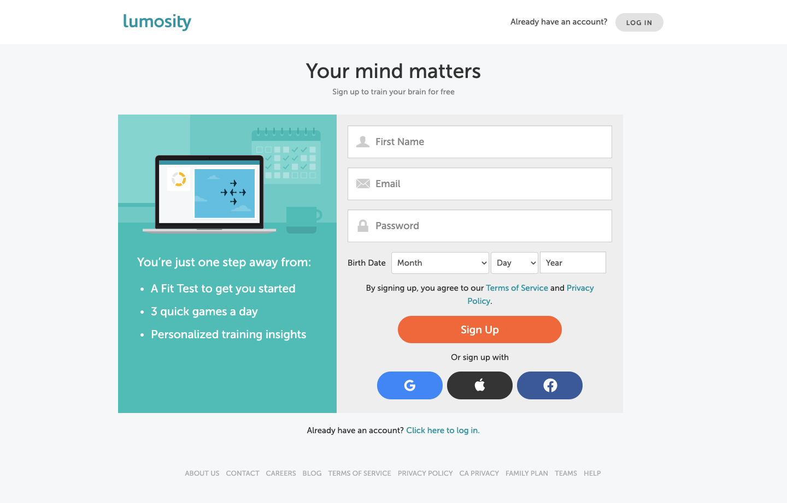
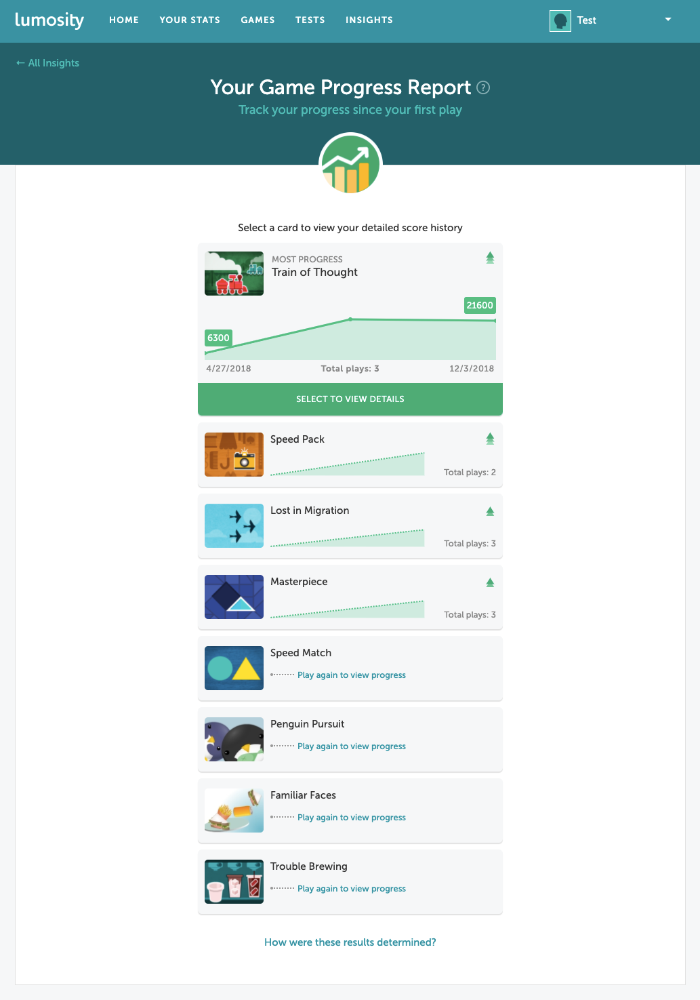

### Omada Health
I primarily work on the billing engine and develop features for the revenue cycle management team. My work is largely backend, with some frontend for our internal application. The stack I work with is Ruby, Rails, and ReactJS.

A recent project I led was building out the concept of work queues. A pain point for our internal stakeholders was the manual checks they had to perform before and after running billing each month, which caused a delay in actions they could take.

What we did was automate their manual checks in our system by putting together and optimizing queries they would conduct across different data sets, and then built out a UI using React for them to be able to take action real-time.

My work at Omada is sensitive, to abide by Protected Health Information (PHI) and Health Insurance Portability and Accountability Act (HIPAA) rules. But if you're curious, please do reach out!

---

### Lumos Labs
I primarily worked on landing pages (with marketing & design teams) and developed new features for the user dashboard (with product, design & data science teams). The stack I worked with was Ruby, Rails, and ReactJS.

One of the landing pages I worked on with marketing was the login page. We would conditionally display a set of banners alongside the login form, based on user information & percentages entered by marketing via [Braze](https://www.braze.com/).

One of the frontend projects I worked on was adding in visualizations and animations (using [Lottie](https://airbnb.design/lottie/)) for a player's game progress report. We ranked by the number of times a game was played and visually displayed how much a player improved (or not!) via a React graphing library.

---

### WePay

I primarily worked on the API, helping develop a [Multi-Factor Authentication API](https://developer.wepay.com/api/implementation/mfa), and eventually shifted towards starting frontend development at the company. As an API-first company then, there was not much UI/UX or design for our products, so it was the first foray into thinking about what the company could offer and what we could build for our customers. 

One of the frontend projects I worked on was a whitelabel solution, which has since evolved into [Clear](https://go.wepay.com/clear/).

The stack I worked in was PHP & Kohana, Python & Flask, and AngularJS.